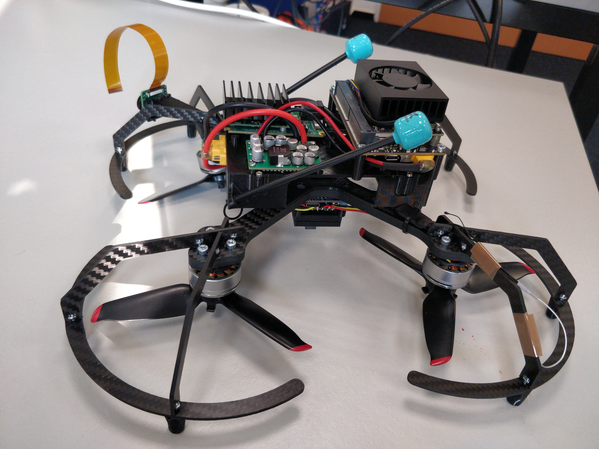

# 🐦‍⬛ HUGIN & MUNIN - Intelligente FPV-Drohnenplattform

## Über das Projekt

Hugin und Munin sind zwei intelligente FPV-Drohnen, benannt nach den Raben des nordischen Gottes Odin. In der nordischen Mythologie fliegen [Hugin („Gedanke“) und Munin („Erinnerung“)](https://de.wikipedia.org/wiki/Hugin_und_Munin) täglich über die Welt, um Odin Wissen zu bringen. Unser Drohnenprojekt verfolgt ein ähnliches Ziel: Die Entwicklung einer autonomen und leistungsfähigen Drohnenplattform mit erweiterter Sensorik, KI-Verarbeitung und FPV-Funktionalität.



## Drohnenübersicht

- **Hugin** – Erste Version der Drohne mit leistungsstarker Rechenplattform (Jetson Orin Nano), FPV-System und Navigationsmodulen.
- **Munin** – Schwesterdrohne

## Komponenten

| Komponenten                               | Beschreibung                            |
|-------------------------------------------|-----------------------------------------|
| **Flugsteuerung**                         |                                         |
| Matek H743 Slim V3 (STM32H743VIH6, DPS310, ICM42688, ICM42688)                        | Flight Controller mit H7-Prozessor      |
| **ESC & Antrieb**                         |                                         |
| Flywoo GOKU G55M 128K 3-6S 45A BLHeli_32 ESC | 45A 4-in-1 ESC für Motorsteuerung       |
| DJI FPV Motoren                           | Brushless-Motoren der DJI FPV           |
| DJI FPV Props (5328S 3-Blade)                            | Propeller der DJI FPV                   |
| Skystars Propeller Mount Adapter          | Adapter für Pushed Montage              |
| **Energieversorgung**                     |                                         |
| 6S 1P Sony / Murata Konion US18650VTC6 3120mAh - 30A                                | 6S Li-Ion Akku mit VTC6 Zellen          |
| Pololu 12V, 15A Step-Down Regulator       | Spannungsregler 12V, 15A                |
| Pololu 5V, 2.5A Step-Down Regulator       | Spannungsregler 5V, 2.5A                |
| **Navigation & Sensoren**                 |                                         |
| Ark Flow (PAW3902, S50LV85D, ICM-42688-P)                                  | Optical Flow Sensor + Rangefinder + IMU      |
| Matek M10Q-5883 (u-blox M10, QMC5883L)                | GPS und Kompassmodul                    |
| **Computer & Peripherie**                 |                                         |
| NVIDIA Jetson Orin NX 16GB                | KI-gestützter Mini-Computer             |
| Seedstudio A603 Carrier                   | Carrier Board für Jetson Orin NX      |
| Luxonis OAK-FFC 4P                        | FFC-Kamera-Modul                        |
| LB-Link BL-M8812EU2 (RTL8812EU-CG)        | WiFi-Modul mit RTL8812EU-CG Chip        |
| Foxeer Lollipop 4 Plus UFL RHCP           |                                         |
| 20P FFC Cable (5CM, Reverse, 0.5mm)       | Flexkabel für Kamera oder Peripherie    |
| 20P FFC Breakout Board                    | Adapterplatine für FFC-Kabel            |


## Installation Jetson

### Flash Jetson Linux

#### Abhängigkeiten
* Ubuntu 22.04 Host-Computer

#### Durchführung
1. (Optional) Neustart in die Recovery mit Login:
    ```bash
    sudo systemctl --reboot-argument=forced-recovery reboot
    ```
2. Folgen der [offiziellen Anleitung von seeed studio](https://wiki.seeedstudio.com/reComputer_A603_Flash_System/) für JP6.2, dabei zu beachten ist:
    * Wenn das Jetson schon in der Recovery ist "Enter Force Recovery Mode" überspringen
    * Nach "Step 2" sollte direkt der Standardnutzer erstellt werden (Passwort eintragen):
        ```bash
        sudo ./tools/l4t_create_default_user.sh -u roblabuser -p CHANGE_THIS -n hugin --accept-license
        ```

### Aufspielen der Software

#### Abhängigkeiten
* Jetpack 6.2 [L4T 36.4.3]

#### Durchführung
1. Mit SCP diesen gesamten Ordner auf das Jetson kopieren, e.g.:
    ```bash
    scp -r Hugin/. roblabuser@hugin.local:/tmp/hugin_setup
    ```
2. SSH auf das Jetson, e.g.:
    ```bash
    ssh roblabuser@hugin.local
    ```
3. Installationsskript ausführen
    ```bash
    sudo /tmp/hugin_setup/jetson/install.sh
    ```
4. Neustarten, um alle Änderungen zu übernehmen
    ```bash
    sudo reboot
    ```

## Installation SteamDeck
!!TODO!!

Aktuell nur im internen Mediawiki unter [Steam Deck]
